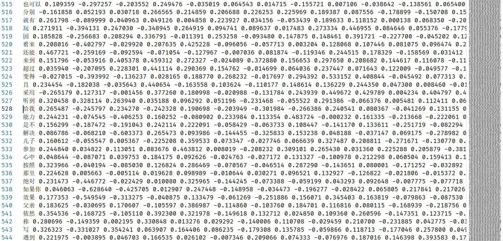
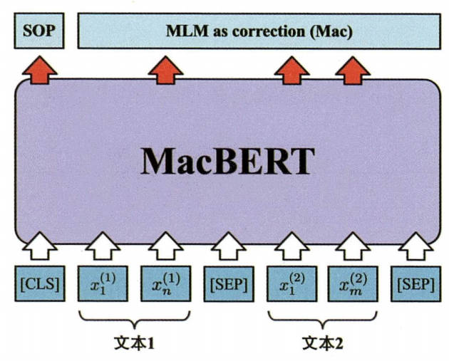

# 《领域方向综合设计》验收

## 一、题目及要求

- **题目**：基于机器学习的文本情感分类
- **语言推荐**：Python
- **设计组成**：数据采集与分析、机器学习算法原理、详细的可视化结果

## 二、数据来源

- **数据集**：使用**新浪微博用户原创微博内容**作为数据来源
- **数据规模**：约 2.1 万用户发布的微博，原始数据量约 50 万条原创微博
- **数据标注**：使用**大模型 API** 进行情感分析标注
- **数据格式**：用户纯文本微博内容作为样本，大模型分析得到的情感类别（**积极、消极、中性**）作为标签
- **最终数据集**：经过筛选与清洗的数据集，包含约 **35 万条微博及情感标签**

> 数据示例：
>
> | 微博文本                                 | 情感标签 |
> | :--------------------------------------- | :------: |
> | 没想到我还能被听泉迷住哈哈哈             |   积极   |
> | 没有别的评价唯有伟大                     |   积极   |
> | 和同事妹妹喝完酒再加班                   |   中立   |
> | 周六的一天。                             |   中立   |
> | 讨厌每一个不看手机就不会走路的人！！！！ |   消极   |
> | 一点睡，六点醒，感觉自己脑瓜子炸了       |   消极   |

## 三、项目流程

### 1. 数据增强

- 数据集存在数据不平衡问题，各情感类别的样本数量差异较大
- 采用**回译技术**进行数据增强
    - 将原始文本翻译为英文，再翻译回中文，生成相同标签的新训练样本
- 增强后数据集规模：约 **38 万条微博文本**，不平衡程度有所降低

> 数据增强示例：
>
> | 原文本                   | 回译文本                        |
> | ------------------------ | ------------------------------- |
> | 仿佛把晚饭和午休进化掉了 | 这就像晚餐和午餐休息 已经进化。 |
> | 这个月吃的第三次火锅。   | 本月第三个火锅                  |
> | 一晚上做了好多梦         | 我整晚做了很多梦                |

### 2. 分词与词元化

- 使用 LTP 库完成分词任务
- 构建词汇表（Vocabulary），用于完成分词后的词语到某个索引的映射
- 原始的文本被映射为若干个索引组成的序列

> 示例：
>
> | 原文本            | 分词文本               | 序列化后文本                        |
> | ----------------- | ---------------------- | ----------------------------------- |
> | 3岁小猫咪生日快乐 | 3,岁,小,猫咪,生日,快乐 | `[3458, 1885, 151, 1887, 616, 130]` |
> | 分享新鲜事        | 分享,新鲜事            | `[1603， 1604]`                     |
> | 我是高脚凳        | 我,是,高脚凳           | `[36, 89, 0]`                       |
>

### 3. 模型构建

- 基于 **PyTorch 框架**，按架构复杂度逐渐增加的顺序，依次实现以下模型：
    1. （基线模型）**TF-IDF + 逻辑回归（LR）**
    2. **多层感知机（MLP）**
    3. **卷积神经网络（CNN）**
    4. **长短期记忆网络（LSTM）**
    5. **Transformer**

### 4. 预训练词向量的集成

- 上述实现模型的词向量层，采用**随机初始化矩阵**形式实现
- 可以使用**预训练的词向量**对文本进行词向量表示

- 将预训练词向量集成到上述实现的模型中

### 5. 预训练语言模型

- 使用 Huggingface 上现成的预训练语言模型 MacBERT 进行训练与测试

### 6. 模型训练、验证与测试

- 按照以下步骤分别对上述实现的各模型进行训练、验证与测试：
    1. **数据预处理**：根据不同模型的输入要求，对数据进行相应的处理

    2. **前向传播**：将输入数据传入模型，计算输出

    3. **计算损失**：使用定义好的损失函数计算预测结果与真实标签之间的误差

    4. **反向传播与优化**：根据损失值计算梯度，并更新模型参数

    5. **统计训练指标**：计算并记录训练集上的损失和准确率

    6. **验证集评估**：在每个训练 Epoch 结束后，在验证集上评估模型性能，使用准确率、F1 值等指标进行评估

    7. **测试集评估**：在模型训练完成后，在测试集上评估模型性能，使用准确率、F1 值等指标进行评估

## 四、结果分析与结论

- 所有模型的测试结果综合比较分析如下图所示

### 1. 性能层次分析（以 F1 分数为性能指标）

- 第一梯队：MacBERT（82.09%）
    - 得益于**大规模预训练**和高度贴合文本任务的**深度建模架构**
- 第二梯队：LSTM（75.65%）
    - 在序列的**时间顺序建模方面**表现优异
- 第三梯队：CNN（74.62%）、MLP（73.63%） 和 TF-IDF + LR（73.78%）
    - TF-IDF + LR 作为**强基线模型**，表现稳定且可解释性强
    - CNN 与 MLP 的架构较为简单，**缺乏深层语义建模能力**，表现基本与基线模型持平
- 第四梯队：Transformer（69.58%）
    - 由于模型**架构复杂**、**训练参数量庞大**，导致**收敛速度慢**，在规定的训练时间内未能达到理想效果
    - 若适当延长训练时间与迭代次数，模型性能可以得到进一步提升

### 2. 预训练词向量的影响

- 对 Transformer 有**显著提升**（69.58% → 74.61%）
    - 高质量词向量有利于注意力机制的运算
- 对 LSTM 有**明显提升**（75.65% → 76.82%）
    - 预训练词向量带来更好的初始语义空间
- 对 CNN 有**轻微提升**（73.63% → 73.67%）
    - 更依赖模式匹配，而非语义组合
- 对 MLP 有**轻微负面影响**（73.63% → 73.42%）
    - 无法建模词序

> [!NOTE]
>
> 预训练词向量的有效性高度依赖于模型架构**是否具备语义建模与结构化信息整合能力**。
>
> 对于缺乏序列与上下文建模机制的模型（如 MLP），高维语义表示可能增加优化难度并引入噪声；
>
> 而对于具备显式序列建模能力的 LSTM 以及依赖表示质量进行全局交互建模的 Transformer，预训练词向量能够显著改善语义表示空间，从而带来明显的性能提升。

### 3. 总结

- **预训练语言模型 MacBERT** 在中文文本情感分类任务上具有显著优势，但由于训练参数量较大，导致训练时间较长
- **序列建模能力**对文本情感分类任务的影响显著，LSTM 的性能明显优于 CNN 与 MLP
- **预训练词向量对不同架构模型的影响差异较大**，其中 LSTM 和 Transformer 受益最多，而对 MLP 和 CNN 的影响较小

### 4. 结论

- **追求极致性能**：使用 MacBERT，虽然模型巨大、计算成本高，但性能显著优于其他所有模型
- **平衡性能与效率**：使用 LSTM + 预训练词向量，性能优异且训练稳定